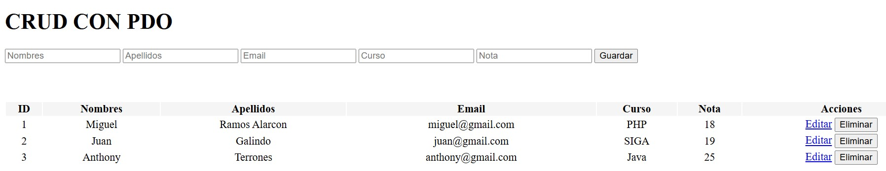

# crud-php-pdo-2024
<h1>Crud realizado con PHP PDO y Mysql</h1>

  
  

Aplicación básica, utilizando PDO con PHP y MySql, utilizando Bootstrap 5. 

## Extensiones Visual Studio Code
- [x] PHP Intelephense
- [x] PHP IntelliSense
- [x] PHP Awesome Snippets

Autor: Miguel A. Ramos Alarcon

> [!IMPORTANT]
> **“En medio de la dificultad reside la oportunidad."** No dejemos de practicar, esforcémonos por lo que nos apasiona.

